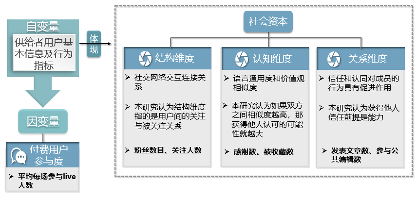
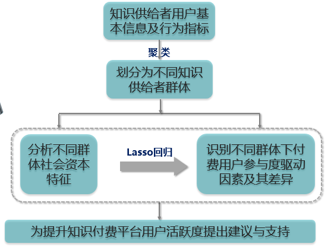

### 毕业论文

#### 目录结构

```
│  readme.md
│
├─code //代码
│  │  crawl_subject_live.py //爬取每个主题下的live数据 
│  │  crawl_related_live.py //爬取和每个live相关的数据 
│  │  crawl_user_info.py //爬取主讲人用户信息
│  │  data_deal.py //数据预处理
│  │  data_model.py //数据建模
│
├─data //数据
│  │  alldata.csv
│  
├─docs //文档
│  │  毕业答辩.pptx
│  │  毕业论文.docx
│  │  爬虫思路.png
│
```

#### 论文题目

知识付费用户参与度驱动因素差异研究——基于社会资本视角 

#### 研究背景

本文以知乎live为例，通过Python爬取了6161条已结束的知乎live数据。首先基于知识供给者的行为信息，通过K-Means聚类将其划分为“专家型”、“中庸型”和“信息搜寻型”三组用户群体，其次构建lasso回归分析不同群体下影响付费用户参与度因素的差异。 

#### 变量说明



#### 研究思路



#### 研究发现

1、发现知识供给者累计的社会资本越多，更能激发他人知识付费行为；

2、结构维度（粉丝数量、关注人数）下的粉丝数量在“信息搜寻型”中对付费用户参与度的正向影响效应最大；

3、认知维度（感谢数、被收藏数）下的两个变量在“专家型”群体中的正向影响效应最大；

4、而关系维度（发表文章数、参与公共编辑数）的影响效应最弱，且只在“专家型”群体中有较小的促进作用。

